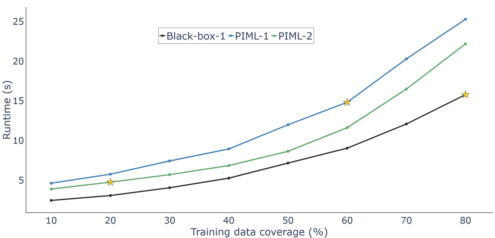

# Public

  
   
  <em>Figure 1 - A graph showing how the amount of training data used impacts the runtime of three compared models, one black-box, two PIML models. The second PIML has known parameters inbuilt (reflecting richer physics knowledge), whereas the first must learn them. A fixed model error target is used - with the stars indicating when each model achieves the required accuracy.</em>

